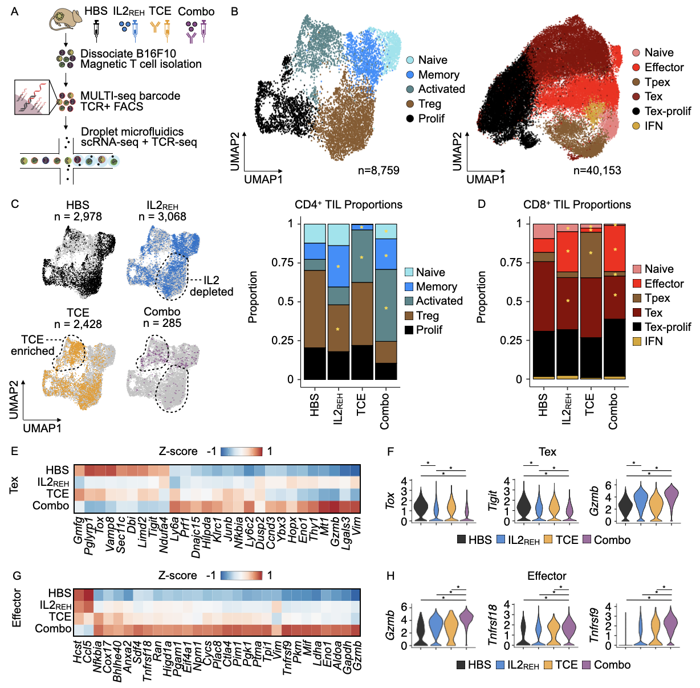
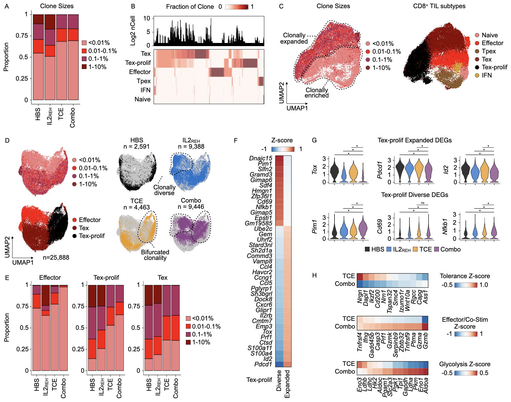

# tce_clonal_replacement
Companion code for Obenaus*, Poupault*, McGinnis*, et al, 2025. "Bispecific T cell engagers control solid tumors through clonal replacement and IL2-driven effector differentiation of CD8 T-cells."

All R objects (including Seurat objects) are available for download at synapse (https://www.synapse.org/Synapse:syn70814720)

Figure 4: TCE-IL2REH combination therapy promotes anti-tumor TIL responses and differentially affects CD4+ and CD8+ TILs.

Figure 5: TCE-mediated tumor growth control is associated with clonal replacement followed by activation of CD8+ TILs.

